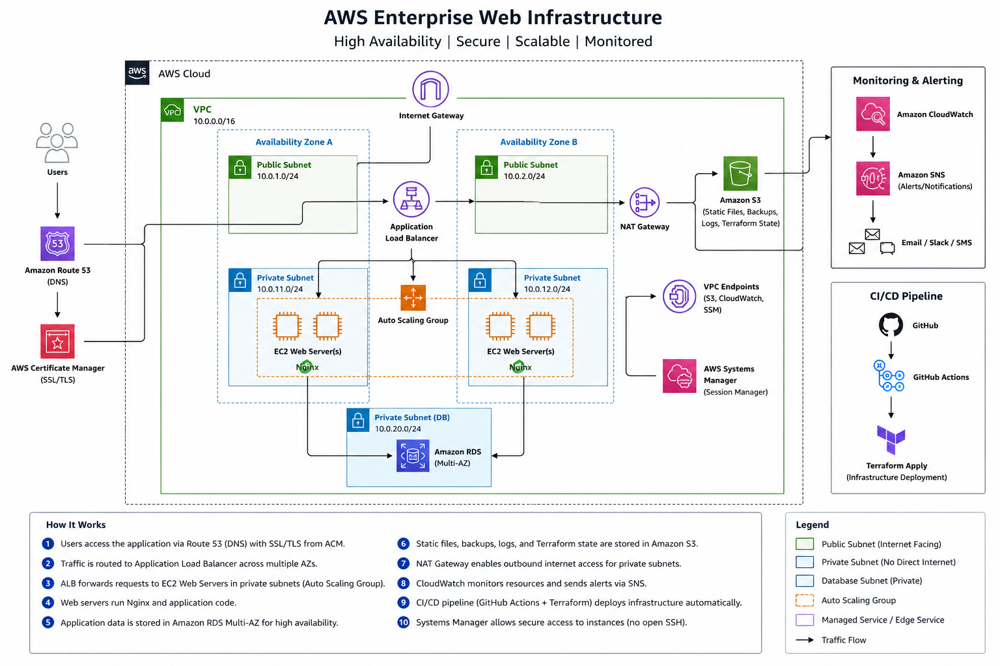

# aws-enterprise-web-infrastructure
Enterprise-grade AWS web infrastructure deployed using Terraform with VPC, EC2, ALB, IAM, CloudWatch, and secure networking architecture.

## Project Structure

```bash
aws-enterprise-web-infrastructure/
│
├── README.md
├── architecture-diagram.png
├── .gitignore
│
├── terraform/
│   ├── main.tf
│   ├── variables.tf
│   ├── outputs.tf
│   ├── provider.tf
│   ├── terraform.tfvars
│   │
│   ├── modules/
│   │   ├── vpc/
│   │   ├── ec2/
│   │   ├── security-group/
│   │   ├── alb/
│   │   └── s3/
│
├── scripts/
│   ├── install-nginx.sh
│   └── monitoring.sh
│
├── screenshots/
│   ├── ec2.png
│   ├── cloudwatch.png
│   ├── vpc.png
│   └── website.png
│
└── docs/
    └── deployment-guide.md
```
## Project Description
This project demonstrates the deployment of a secure and scalable AWS web infrastructure using Terraform Infrastructure-as-Code principles.

The environment includes:
- VPC with public/private subnets
- EC2 web servers
- Application Load Balancer
- IAM roles and security groups
- CloudWatch monitoring
- S3 storage
- Auto Scaling configuration

## Architecture Diagram


Architecture Should Include
Internet
   ↓
Application Load Balancer
   ↓
EC2 Instances
   ↓
Private Subnet
   ↓
Database

Plus:

NAT Gateway
IAM
CloudWatch
S3


